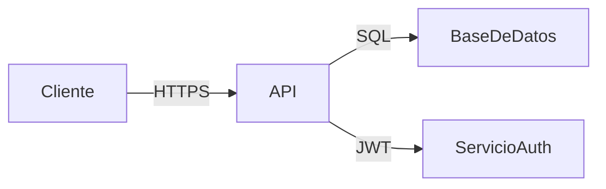
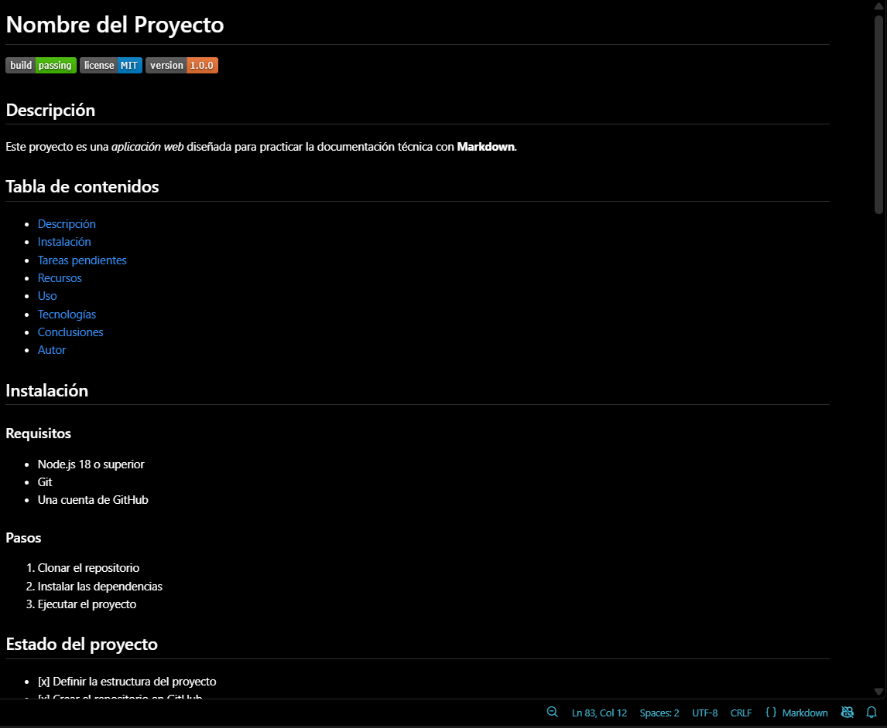

# Nombre del Proyecto


## Descripción

Este proyecto es una *aplicación web* diseñada para practicar la documentación técnica con **Markdown**.

## Tabla de contenidos
- [Descripción](#descripción)
- [Instalación](#instalación)
- [Tareas pendientes](#tareas-pendientes)
- [Recursos](#recursos)
- [Uso](#uso)
- [Tecnologías](#tecnologías)
- [Capturas](#capturas)
- [Contribuidores](#Contribuidores)

## Instalación

### Requisitos

- Node.js 18 o superior
- Git
- Una cuenta de GitHub

### Pasos

1. Clonar el repositorio
2. Instalar las dependencias
3. Ejecutar el proyecto

## Estado del proyecto

- [x] Definir la estructura del proyecto
- [x] Crear el repositorio en GitHub
- [ ] Escribir pruebas unitarias
- [ ] Despliegue en producción

## Arquitectura 




## Uso

Ejecuta el proyecto con el comando `npm start`.

```javascript
function saludar(nombre) {
  console.log(`Hola, ${nombre}`);
}
```

## Tecnologías

| Tecnología | Versión | Propósito                   |
| ---------- | ------- | --------------------------- |
| Node.js    | 18.x    | Entorno de ejecución        |
| Express    | 4.x     | Framework para el servidor  |
| MongoDB    | 6.x     | Base de datos               |

> Nota: este proyecto se encuentra en desarrollo activo.

## Capturas 
 

## Contribuidores 

- [@DARK](https://github.com/moisesllajarunasare13-gif) — Desarrollo y documentación 

Sección: C24
